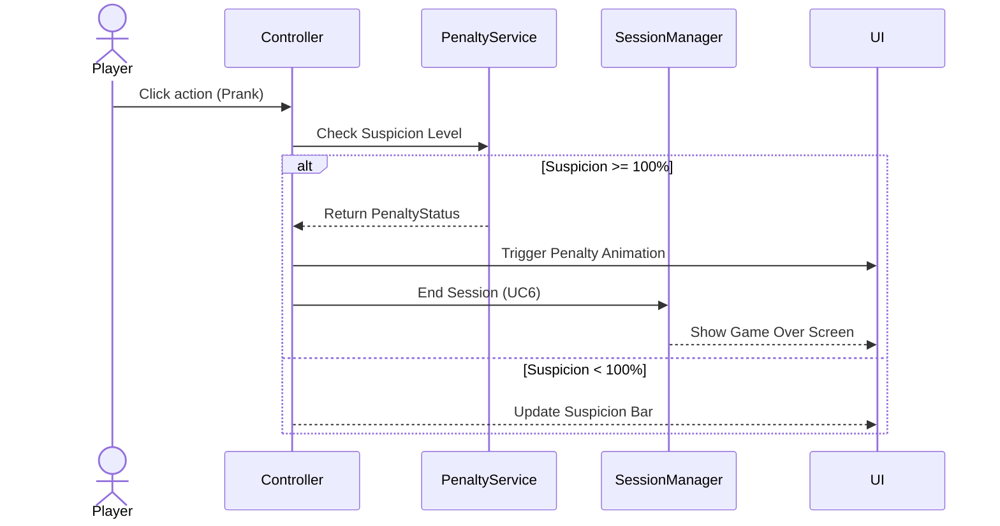
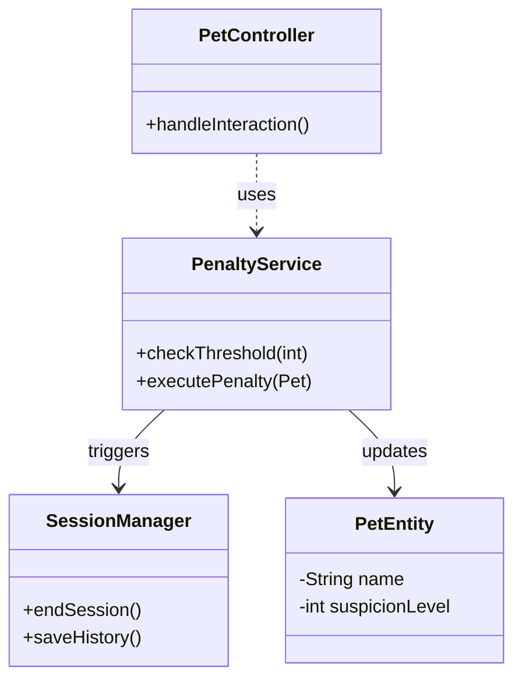

# 🎮 Dự án: My Silly Bestie - Giai đoạn 2

**Tài liệu đặc tả: Xử lý hình phạt và Kết thúc phiên chơi**

---

## 1. Mô tả Use Case đã chọn

### 1.1. Nhóm Use Case 5 & 6: Xử lý hình phạt & Kết thúc lượt (Penalty & Session End)

Đây là giai đoạn xử lý logic phản ứng của thú cưng khi đạt giới hạn chịu đựng, đảm bảo tính chân thực và thách thức cho người chơi.

#### Bảng đặc tả chi tiết:

| Thành phần | Nội dung mô tả |
| --- | --- |
| **Tên Use Case** | **UC5: Xử lý hình phạt & UC6: Kết thúc lượt** |
| **Tác nhân (Actor)** | Người chơi (Player), Hệ thống (System) |
| **Mô tả tóm tắt** | Hệ thống theo dõi chỉ số "Nghi ngờ" (Suspicion) và kích hoạt phản ứng đáp trả (Penalty) cùng quy trình kết thúc phiên chơi khi giới hạn bị vi phạm. |
| **Tiền điều kiện** | Người chơi đang trong chế độ tương tác (Prank Mode) và thanh chỉ số Suspicion đã được khởi tạo. |
| **Luồng sự kiện chính** | 1. Hệ thống liên tục cập nhật chỉ số Suspicion dựa trên hành động của người chơi. <br>

<br> 2. Khi Suspicion đạt ngưỡng 100%, hệ thống kích hoạt hoạt cảnh (animation) phản ứng từ thú cưng. <br>

<br> 3. Hệ thống hiển thị thông báo "Phản ứng đáp trả" (Penalty) mang tính hài hước. <br>

<br> 4. Hệ thống thực hiện UC6: Tự động dừng phiên chơi (End Game). <br>

<br> 5. Hệ thống hiển thị bảng kết quả và yêu cầu người chơi bắt đầu lượt mới. |
| **Hậu điều kiện** | Phiên chơi hiện tại bị đóng, chỉ số trạng thái được reset về mặc định. |
| **Ngoại lệ** | Người chơi thoát ứng dụng đột ngột: Hệ thống lưu trạng thái cuối cùng vào lịch sử tương tác trước khi giải phóng phiên chơi. |

---

## 2. Lược đồ Sequence (UC5 & UC6)

Sơ đồ dưới đây mô tả trình tự tương tác khi người chơi thực hiện hành động trêu đùa đạt ngưỡng hình phạt:



*Hình 3.3: Lược đồ Sequence xử lý UC5 và UC6*

---

## 3. Sơ đồ lớp thiết kế (Class Diagram)

Sơ đồ trình bày các lớp nghiệp vụ chính phục vụ cho việc xử lý logic hình phạt và kết thúc lượt chơi:



*Hình 3.4: Sơ đồ lớp chi tiết cho UC5 và UC6*

---

## 4. Implement (Hiện thực hóa UC 5+6)

Hệ thống sử dụng **PenaltyService** để điều phối logic hình phạt và **SessionManager** để xử lý kết thúc phiên chơi, đảm bảo tính module hóa cao.

### 4.1. Lớp Dịch vụ Hình phạt (PenaltyService.java)

```java
@Service
public class PenaltyService {
    // Logic kiểm tra ngưỡng hình phạt
    public boolean checkThreshold(int currentSuspicion) {
        return currentSuspicion >= 100;
    }

    public void executePenalty(PetEntity pet) {
        // Thực hiện trigger animation đáp trả
        System.out.println("Penalty triggered for: " + pet.getName());
    }
}

```

### 4.2. Lớp Quản lý Phiên chơi (SessionManager.java)

```java
@Service
public class SessionManager {
    public void endSession() {
        // Thực hiện ghi nhận kết quả và đóng phiên tương tác
        System.out.println("Session ended. Game over.");
    }
}

```

---
