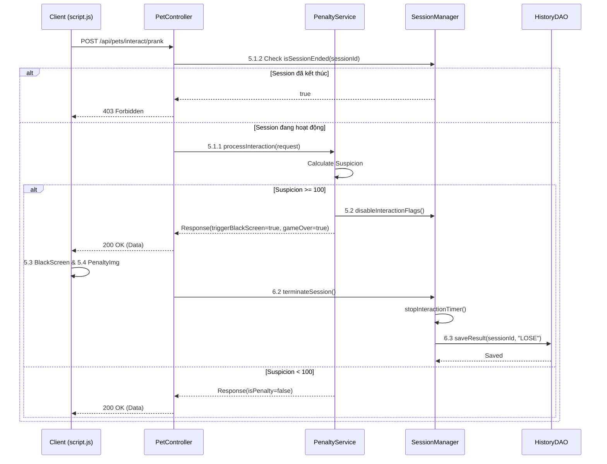
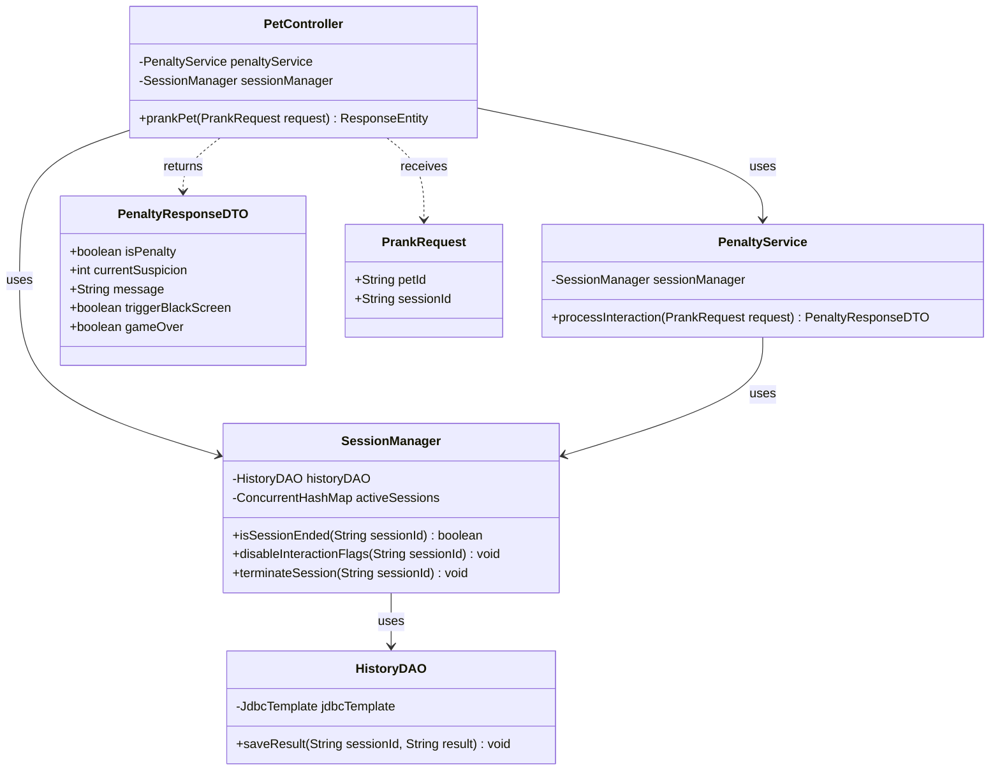

# 🎮 Dự án: My Silly Bestie - Giai đoạn 2

**Tài liệu đặc tả: Xử lý hình phạt và Kết thúc phiên chơi**

---

## 1. Mô tả Use Case đã chọn

### 1.1. Nhóm Use Case 5 & 6: Xử lý hình phạt & Kết thúc lượt (Penalty & Session End)

Đây là bản cập nhật chi tiết nhất, được tối ưu hóa để bạn dán trực tiếp vào file `.md`. Nội dung đã bao gồm bảng đặc tả nghiệp vụ có đánh số và sơ đồ trình tự tương ứng với mã nguồn bạn đã xây dựng.

| STT | Bước | Mô tả nghiệp vụ | Vị trí hiện thực hóa (File/Phương thức) |
| :--- | :--- | :--- | :--- |
| 1 | **5.1.1** | Ghi nhận chỉ số `Suspicion` đạt ngưỡng 100% | `PenaltyService.processInteraction()` |
| 2 | **5.1.2** | Chặn spam request khi màn hình đã đen | `PetController.prankPet()` |
| 3 | **5.2** | Vô hiệu hóa toàn bộ input từ người chơi | `SessionManager.disableInteractionFlags()` |
| 4 | **5.3** | Kích hoạt hiệu ứng "Fade-to-black" | `PenaltyResponseDTO` (Flag `triggerBlackScreen`) |
| 5 | **5.4** | Thay đổi hình ảnh thú cưng sang "Penalty" | `script.js` (Hàm `handleInteraction`) |
| 6 | **6.1** | Hiển thị thông báo "Bạn đã thua" | `PenaltyResponseDTO` (Trường `message`) |
| 7 | **6.2** | Dừng mọi tiến trình tương tác (Timer) | `SessionManager.terminateSession()` |
| 8 | **6.3** | Ghi log kết quả "LOSE" vào DB | `HistoryDAO.saveResult()` |
| 9 | **6.4** | Kích hoạt nút "Chơi lại" trên giao diện | `PenaltyResponseDTO` (Flag `gameOver`) |

## 2. Sơ đồ Trình tự (Sequence Diagram)

Dưới đây là sơ đồ thể hiện luồng logic giữa các thành phần trong hệ thống:



*Hình 3.3: Lược đồ Sequence xử lý UC5 và UC6*

---

## 3. Sơ đồ lớp thiết kế (Class Diagram)



*Hình 3.4: Sơ đồ lớp chi tiết cho UC5 và UC6*

---

## 4. Implement (Hiện thực hóa UC 5+6)

### PetController.java (Điều phối & Bước 5.1.2)
```java
@PostMapping("/interact/prank")
public ResponseEntity<?> prankPet(@RequestBody PrankRequest request) {
    // 5.1.2: Luồng phụ - Chặn spam request khi game đã ở trạng thái GameOver
    if (sessionManager.isSessionEnded(request.sessionId())) {
        return ResponseEntity.status(HttpStatus.FORBIDDEN).body("Phiên chơi đã kết thúc!");
    }
    return ResponseEntity.ok(penaltyService.processInteraction(request));
}

```

### PenaltyService.java (Bước 5.1.1, 5.2)

```java
@Service
public class PenaltyService {
    @Autowired private SessionManager sessionManager;

    // 5.1.1: Ghi nhận và kiểm tra ngưỡng
    public PenaltyResponseDTO processInteraction(PrankRequest request) {
        int currentSuspicion = calculateSuspicion(request.petId());
        
        if (currentSuspicion >= 100) {
            // 5.2: Vô hiệu hóa input cho phiên chơi
            sessionManager.disableInteractionFlags(request.sessionId());
            
            // 5.3, 6.1, 6.4: Trả về trạng thái kết thúc
            return new PenaltyResponseDTO(
                true, 100, "Bạn đã thua!", true, true
            );
        }
        return new PenaltyResponseDTO(false, currentSuspicion, "Pet đang nghi ngờ...", false, false);
    }
}

```

### SessionManager.java (Bước 6.2, 6.3)

```java
@Service
public class SessionManager {
    @Autowired private HistoryDAO historyDAO;

    // 6.2: Dừng tiến trình
    public void terminateSession(String sessionId) {
        stopInteractionTimer(sessionId);
        // 6.3: Ghi log kết quả "LOSE" vào DB
        historyDAO.saveResult(sessionId, "LOSE");
    }

    public void disableInteractionFlags(String sessionId) { 
        // Logic đánh dấu session đã bị khóa input
    }
}

```

## 3. Mã nguồn Frontend (script.js)

```javascript
async function handleInteraction() {
    try {
        const response = await fetch('/api/pets/interact/prank', {
            method: 'POST',
            headers: { 'Content-Type': 'application/json' },
            body: JSON.stringify({ petId: 'capy-01', sessionId: currentSessionId })
        });

        if (!response.ok) return; // Chặn spam (5.1.2)

        const data = await response.json();

        // 5.3: Kích hoạt hiệu ứng "Fade-to-black"
        if (data.triggerBlackScreen) {
            document.getElementById('black-overlay').style.display = 'block';
        }

        // 5.4: Thay đổi hình ảnh sang "Penalty"
        if (data.isPenalty) {
            document.getElementById('pet-img').src = '/assets/images/penalty_pet.png';
        }

        // 6.1: Hiển thị thông báo thua & 6.4: Hiện nút Chơi lại
        if (data.gameOver) {
            alert(data.message);
            document.getElementById('reset-btn').style.display = 'block';
        }
    } catch (err) { console.error("Lỗi:", err); }
}

```


